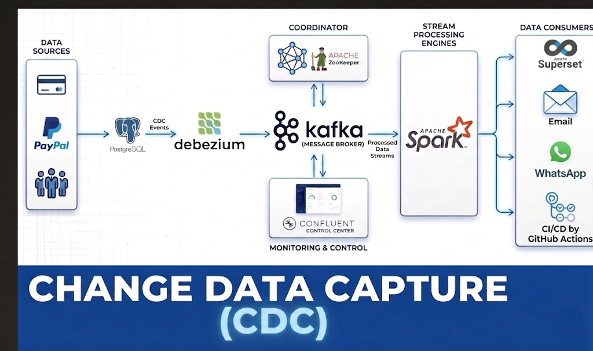
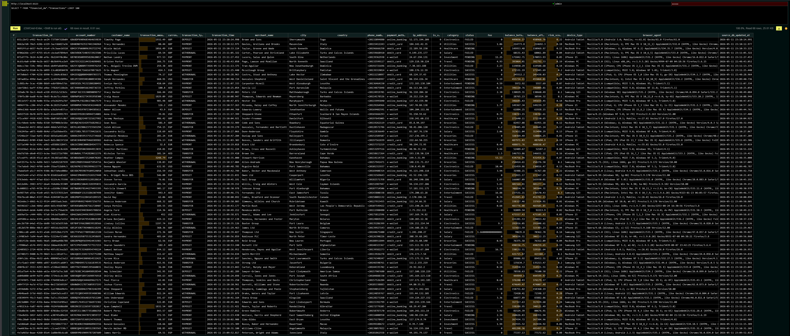

# 🏦 Bank-Grade Real-Time CDC Data Pipeline

[](https://spark.apache.org/)
[](https://kafka.apache.org/)
[](https://clickhouse.com/)
[](https://superset.apache.org/)

A production-grade, end-to-end Change Data Capture (CDC) pipeline designed for financial real-time analytics. This project captures transactions from **PostgreSQL**, streams them through **Kafka**, processes them via **Spark Streaming**, and stores them in **ClickHouse** for visualization in **Superset**.

---

## 🏗️ System Architecture


The system is divided into 6 isolated layers designed for high throughput and sub-second latency.

---

## 📊 Professional Financial Dashboard (v4)
The visualization layer has been upgraded to **Version 4**, featuring 15 real-time charts with native filtering and automatic refresh every 5 seconds.

````carousel

<!-- slide -->

<!-- slide -->

<!-- slide -->

````

### Key Visualizations:
*   **Real-time KPIs**: Total Volume, Operation Count, Avg Risk Score, and Total Fees.
*   **Whale Tracking**: Automated detection of high-value transactions (>55,000 EGP).
*   **Geographic Breakdown**: Transaction distribution by City and Merchant.
*   **Risk Heatmaps**: Average risk score per category and status.

---

## ⚡ Smart Alerting Engine (Security Layer)
The pipeline monitors every transaction in real-time. When a **VIP transaction** or a **High-Risk event** is detected, the system triggers multi-channel alerts.

| 📧 Email Security Alerts | 📱 WhatsApp Instant Alerts |
|:---:|:---:|
|  |  |

---

## 🗄️ ClickHouse Data Warehouse (OLAP)
Optimized for massive financial datasets, featuring 23 enriched fields and strict schema enforcement.



### Enforced Schema Highlights:
*   **23 Enriched Fields**: Including `risk_score`, `balance_delta`, `device_type`, and `geo_location`.
*   **Deduplication**: Powered by `ReplacingMergeTree` to ensure 100% data consistency.
*   **Watermarking**: `source_db_updated_at` ensures correct event sequencing.

---

## 🚀 Quick Start (Production Setup)

### 1. Initialize Infrastructure
```powershell
powershell scripts/reset_project.ps1
```

### 2. Configure Pipelines & Dashboard
```bash
python scripts/setup_pipeline.py
python superset/import_wizard.py
```

### 3. Start Real-Time Data Flow
*   **Start Generator:** `python generator/main.py` (Now with 1% Whale Transaction logic).
*   **Start Spark Brain:** Run `notebooks/spark_realtime_pipeline.py`.

---

## 📁 Project Structure
- `generator/`: High-performance data generators (v2) with "Whale Transaction" logic.
- `superset/`: Custom Docker & **Import Wizard v4** (Dashboard-as-Code).
- `notebooks/`: Spark Structured Streaming & Multi-channel Alerting logic.
- `image/`: Visual assets and architectural diagrams.

---
*For more details, check the [Full Technical Documentation](./docs/CDC_DWH_DOCUMENTATION.md).*
