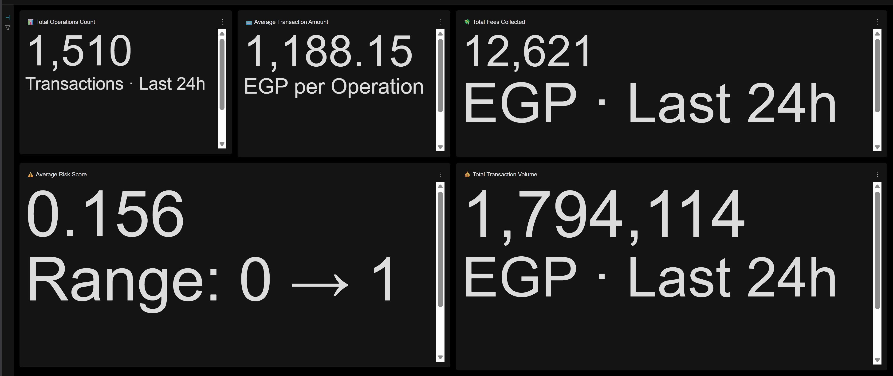
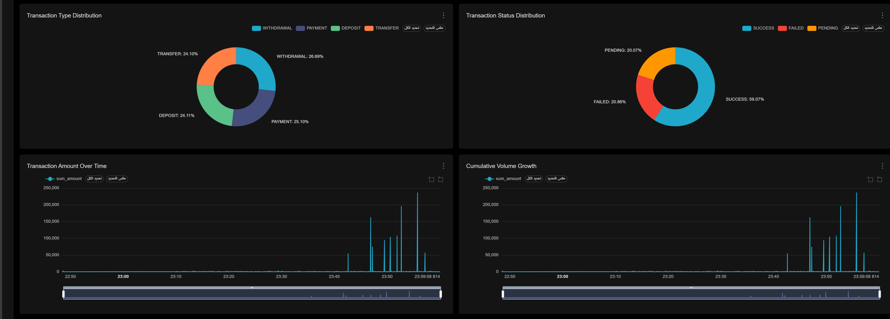
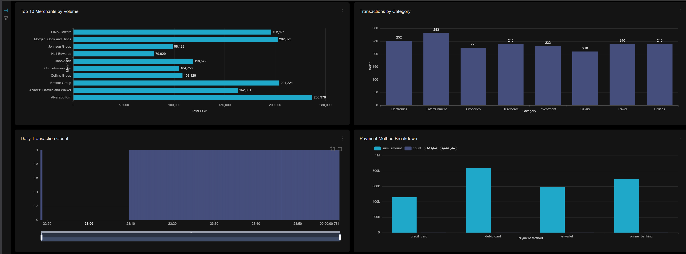
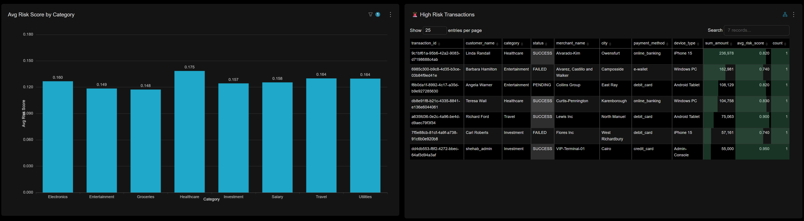

# 📊 Layer 5: Visualization & Business Intelligence (Superset v4)

The visualization layer is the window into the entire pipeline. It transforms raw financial data into actionable insights using **Apache Superset**.

---

## 🚀 Dashboard-as-Code (Import Wizard v4)
We utilize a custom-built **Import Wizard** (`superset/import_wizard.py`) to automate the deployment of the entire BI stack.

*   **Version 4 Highlights**:
    *   **15 Professional Charts**: Ranging from real-time KPIs to complex time-series and categorical bars.
    *   **Native Filters**: 6 global filters (Time, Status, Type, Category, City, VIP).
    *   **Auto-Sync**: Automatically detects schema changes in ClickHouse and updates Superset datasets.

---

## 🖼️ Dashboard Gallery

*Figure 1: Main Overview showing real-time Transaction Volume and Average Values.*

*Figure 2: Distribution charts for Transaction Types and Status (Success/Failed/Pending).*

*Figure 3: Time-series analysis showing transaction flows and cumulative growth.*

*Figure 4: The Security Row - High-risk transaction tables and category risk scores.*

---

## 📈 Chart Specifications
The dashboard is structured into 6 logical rows:
1.  **KPI Cards**: Big numbers for instant health checks.
2.  **Market Share**: Pie/Donut charts for type and status distribution.
3.  **Trend Lines**: Time-series analysis of volume and cumulative growth.
4.  **Categorical Analysis**: Bar charts for top merchants and categories.
5.  **Operational Metrics**: Daily counts and payment method breakdowns.
6.  **Security/Risk**: Detailed tables of high-risk transactions.

---

## ⚙️ Configuration
The dashboard configuration is managed via `SUPERSET_DASHBOARD_PRO.yaml` and the automated wizard, ensuring a consistent environment across development and production.

---
**[⬅️ Previous: Layer 4](./L4_Storage_Layer.md) | [🏡 Home: Master Doc](./CDC_DWH_DOCUMENTATION.md) | [Next: Layer 6 (Alerting) ➡️](./L6_Alerting_Layer.md)**
