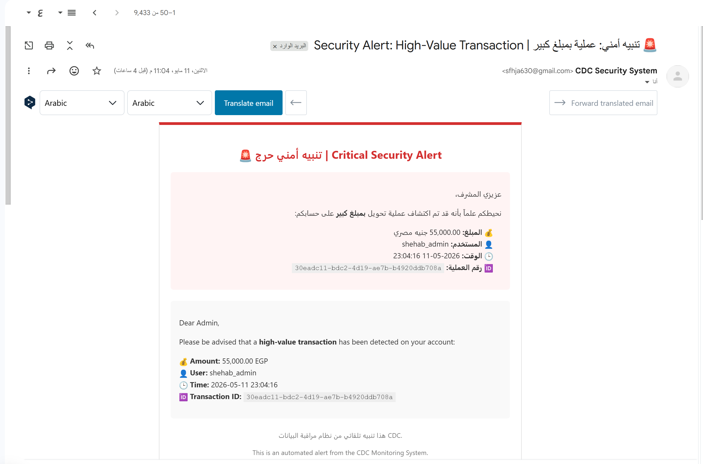
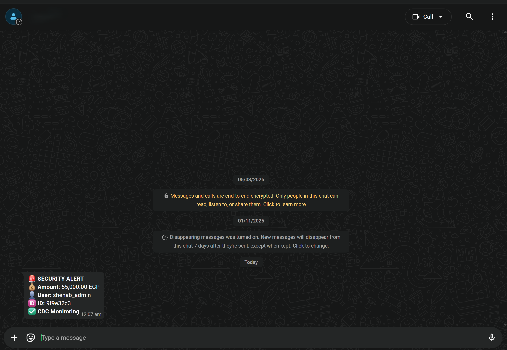

# 🚨 Layer 6: Real-Time Security & Alerting Layer

The Alerting Layer is the critical security component that monitors the Spark Streaming pipeline for suspicious or high-value activities.

---

## ⚡ Multi-Channel Trigger System
The system is designed to notify administrators immediately when specific conditions are met:
1.  **VIP Transactions**: Any transaction performed by an admin or VIP account.
2.  **High-Risk Events**: Transactions with a `risk_score > 0.7`.
3.  **Whale Transactions**: Amounts exceeding **55,000 EGP**.

---

## 📧 Email Notifications (Gmail)
Every alert triggers a professional HTML-formatted email sent to the system administrator.



*   **Technology**: Python `smtplib`.
*   **Content**: Includes Transaction ID, Amount, Customer Name, and Risk Score.

---

## 📱 WhatsApp Instant Alerts
For immediate attention, the system triggers a WhatsApp message directly to the admin's phone.



*   **Technology**: Automated browser/API triggers.
*   **Speed**: Alerts are delivered within 5-10 seconds of the transaction occurring in Postgres.

---

## 🛠️ Configuration
Alerting credentials (SMTP and Phone numbers) are managed securely via the project's central `.env` file.

```bash
# Example .env configuration
ADMIN_PHONE=+201289910575
EMAIL_SENDER=sfhja630@gmail.com
EMAIL_RECEIVER=shahbahmed56p@gmail.com
```

---
**[⬅️ Previous: Layer 5](./L5_Visualization_Layer.md) | [🏡 Home: Master Doc](./CDC_DWH_DOCUMENTATION.md) | [Next: Master Schema 💎](./MASTER_SCHEMA.md)**
